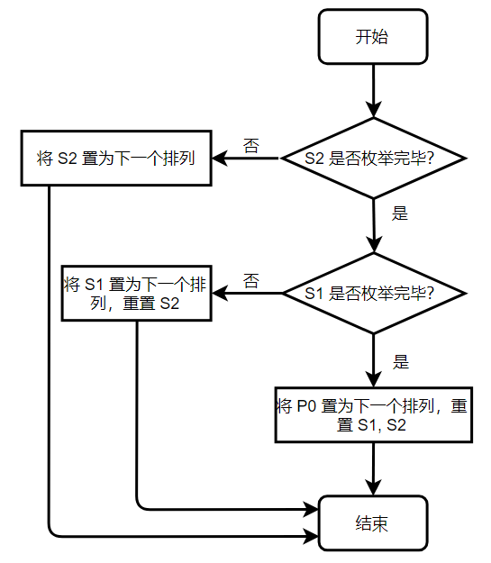

# Sudoku

2018 年秋季学期《软件工程基础》课程个人项目作业

数独终局生成与求解程序，运行于 Windows 平台，使用 C++ 开发。

Github 项目地址 ：https://github.com/lytning98/sudoku

[TOC]

## 一、PSP表格

| PSP2.1                                  |   Personal Software Process Stages   | 预估耗时（分钟） | 实际耗时（分钟） |
| :-------------------------------------- | :----------------------------------: | :--------------: | :--------------: |
| **Planning**                            |               **计划**               |      **10**      |      **5**       |
| - Esitimate                             |             估计任务时间             |        10        |        5         |
| **Development**                         |               **开发**               |    **1,065**     |    **1,170**     |
| - Analysis                              |               需求分析               |        45        |        30        |
| - Design Spec                           |             生成设计文档             |        40        |        40        |
| - Design Review                         |               设计复审               |        20        |        10        |
| - Coding Standard                       |               代码规范               |        20        |        20        |
| - Design                                |               具体设计               |       180        |       200        |
| - Coding                                |               具体编码               |       600        |       750        |
| - Code Review                           |               代码复审               |        60        |        40        |
| - Test                                  | 测试（自我测试、修改代码、提交修改） |       100        |        80        |
| **Reporting**                           |               **报告**               |     **240**      |     **400**      |
| - Test Report                           |               测试报告               |        30        |        20        |
| - Size Measurement                      |              计算工作量              |        20        |        25        |
| - Postmortem & Process Improvement Plan |      事后总结并提出过程改进计划      |       190        |       355        |
|                                         |                 合计                 |      1,315       |      1,575       |

## 二、题目分析及解题思路

本题要求实现一个数独终局的生成器和数独解题程序，需求较为明显的分为相对独立的两大部分：终局生成与解题，可以分别进行思考、设计和实现。

### 1.	终局生成

数独终局指一个填满数字 $1$ ~ $9$ 的 $9\times 9$ 棋盘，满足其中每一行、每一列、每一九宫格中每个数字只出现一次。一个典型的数独棋盘如图所示，粗实线标出的是九宫格的边界。

本题要求程序生成至多 $10^6$ 种数独终局。


由数独的性质，每一行中的数字一定形成一个 1~9 的排列，所以很容易想到使用一个排列生成数独终局的方法。

先取任意一个排列 $P_0$ ，填入数独的第一行。随后观察第二行。为了满足每一列上每个数字只出现一次的要求，第二行应该是第一行的一个**错位排列**，为了简单起见，可以简单的将第一行做**循环移动**来得到一些典型的错位排列。

此处我们记 $P_0$ 循环左移 $i$  位得到的排列为 $P_i$ ，如 $P_0 = \{1,2,3,4,5,6,7,8,9 \}$ 时，$P_3 = \{4,5,6,7,8,9,1,2,3\}$.

接下来尝试只使用循环排列填入每一行来得到数独终局。为了满足同一九宫格内的限制，属于同一九宫格的三行，其中任两行中的排列，下表之差必须为 $3$ 的倍数，否则九宫格内另一行会与此两行冲突。因此第二、三行只能填入 $P_3$ 和 $P_6$ ，如下表。

|  1   |  2   |  3   |  4   |  5   |  6   |  7   |  8   |  9   |
| :--: | :--: | :--: | :--: | :--: | :--: | :--: | :--: | :--: |
|  4   |  5   |  6   |  7   |  8   |  9   |  1   |  2   |  3   |
|  7   |  8   |  9   |  1   |  2   |  3   |  4   |  5   |  6   |

在第四行分别尝试 $P_1$ ~ $P_8$，发现 $P_1$ 总是合法，若将 $P_1$ 填入第四行，则第 4~6 行的情形将与前三行相似。类似地将该过程应用于第 7~9 行，可得由原排列 $P_0$ 生成的一个数独终局如下
$$
\{P_0, P_3, P_6; P_1, P_4, P_7;P_2,P_5,P_8\}
$$
由于棋盘左上角为由学号生成的固定数字，排列 $P_0$ 只有 $8!=40,320$ 种。进一步观察可以发现，属于同一九宫格的三行（如第 4~6 行）中的排列，只要保证下标模 $3$ 同余，其内部顺序可以任意调换。若对上述的终局重新打乱第 4~6 行和第 7~9 行的内部顺序，则可以将终局数量扩大到 $3! \times 3! \times 8! = 1,451,520$ 种，已经可以满足要求。

### 2.	数独求解

数独求解即给定一个部分挖空的数独终局，在所有空白处填入数字使其恢复为合法的终局。

由于数独本身的限制条件非常强，且此场景下仅有三阶，这个任务十分适合带有剪枝的深度优先搜索算法完成。该算法将扫描每一个空白格并依次尝试可以填入的每一个数字，当某一位置无数字可填时剪枝返回，填满全部空白格时即找到了一组解。

在三阶数独的强限制条件下，该算法每尝试一个数字都能极大的缩小搜索范围，且算法结构简单，可以迅速灵活的开始和结束搜索而无需过多准备工作，效率表现极佳。

## 三、设计、实现简述与单元测试设计

本项目的设计实现将对两个相对独立的模块分别进行阐述。

由于项目复杂度较低，本章内容将概要设计与详细设计结合，直接一同给出；同时由于设计出的流程等都较为简单直接，以下内容将设计与一定的简要实现说明结合，也一同给出。

本项目的单元测试使用微软 Visual Studio 自带的 MSTest 测试工具进行，各个单元的测试用例描述也将在下文的相应章节给出。测试用例的实现位于 `UnitTest\UnitTest.cpp` 文件中。

 ### 1.	终局生成

*本部分实现位于 `console\generator.cpp` 文件中。*

生成终局的方式见前一章所述，主要通过对排列进行移位操作来实现。由于需求中只对数独终局作出了**不重复**的要求，而没有要求随机，因此在本程序中生成的终局序列是固定的。

该部分算法较为简单直接，主要通过以下几个函数实现。

```c++
generator::step_forward() 	// 枚举终局所需的排列
generator::generate()		// 使用枚举出的排列生成一组终局
generator::print()			// 将终局写入文件
```

下面将对各函数细节进行描述。

#### 1.1	根据排列生成一组终局

*本部分功能在函数 `generator::generate` 中实现。*

根据前一章所述的生成方法，生成终局时首先需要枚举第一行中数字的排列 $P_0$，有了排列 $P_0$ 后即可如前一章所示根据 $P_0$ 生成出一个数独终局：
$$
L(P_0) = \{P_0, P_3, P_6; P_1, P_4, P_7;P_2,P_5,P_8\}
$$
为了增加终局的数量，生成出终局 $L(P_0)$ 后还需要枚举第 4~6 行和第 7~9 行的所有行间排列。这可以通过使用类似的方法枚举两个长度为 3 的排列 $S_1, S_2$ 实现，例如当 $S_1 = \{0, 2, 1\}$ 时，代表将第 4~6 行的终局重新排列为 $\{L_4, L_6, L_5\}$ ，其中 $L_i$ 代表排列 $L(P_0) $ 的第 $i$ 行。

**单元测试**：对该单元共设计了一个测试用例：对生成出的终局作合法性检测，包括行、列、九宫格的冲突和数字范围检查。对应于测试方法 `GeneratorTest::GeneratorConflictionTest` 。

#### 1.2	枚举排列

*本部分功能在函数 `generator::step_forward` 中实现。*

单个排列的枚举可以通过 C++ STL 函数 `std::next_permutation` 来实现。此处需要同时枚举三个排列$P_0, S_1, S_2$ 的组合状态，可以通过如下的策略来枚举。



该流程被执行一遍，三个排列的组合状态就步进一次。

**单元测试** ：对该单元的测试包含3个测试用例，分别对流程中的全部三条分支进行了测试，主要是比较枚举下一状态前后三个排列的状态变化。对应的测试方法是 `GeneratorTest::EnumerationTest1` 等三个方法。

### 2.	数独求解

*本部分实现位于 `console\solver.cpp` 及 `console\solver.hpp` 文件中。*

数独求解过程即不断重复“读取题目—解题—将答案写入文件”的过程，其中解题为一个深度优先搜索（Depth First Search，DFS，下同）的过程。

为了加速 DFS 中判断何种数字已被使用的过程，项目还需要实现一个简易的 `bitset` 类，其功能与 C++ STL `std::bitset` 相近，用于封装对二进制比特位的操作。本程序中使用的二进制比特位只有约 10 位，因此自行实现该类而非直接使用 STL 类库能够有效的加快速度。

由于当题目组数较多、题目空白较少或难度较低时，DFS 求解消耗的时间较少，反而将解答写入文件的时间消耗较多，容易成为瓶颈，因此程序还需采用多线程的方式，主线程用于求解数独，第二个线程用于进行文件 IO 操作。

以下将上述三个部分分别描述。


#### 2.1	Bitset 类

*即实现于 `console\solver.hpp` 中的 `solver::bitset` 类。*

该类主要封装了对二进制比特位的操作，包括将指定比特位置“0”、置“1”，查询指定比特位的状态，比特位清零等。

```c++
solver::bitset::set(int p);		// 将指定比特位置“1”
solver::bitset::erase(int p);	// 将指定比特位置“0”
solver::bitset::test(int p);	// 查询指定比特位的状态
solver::bitset::reset();		// 所有位清零
```

由于本程序中操作的比特位数量仅有 10 位，各比特位的数据以一个 `int` 变量存储。

各操作都通过与、或、异或等位运算实现以提高速度。

**单元测试** ：对该单元的测试包含三个测试用例，对该类的各个函数分别进行了正确性检测。相关的测试方法位于 `UnitTest::SolverBitsetTest` 类中。

#### 2.2	DFS

*本部分功能在命名空间 `solver::DFS` 中实现。*

在开始搜索前，程序需要首先计算出题目给定局面下每一个位置所有能填入的数字作为候选答案。

求解数独时，程序将会从左上角起遍历整个棋盘，对于每一个未填数字的位置，依次尝试该位置提前计算出的候选答案 ，若不与当前行列和九宫格的状态产生冲突，则将此位置上的数字拟定为当前选择，并继续遍历棋盘。

若整个棋盘被遍历完毕，说明找到了一组合法解，搜索过程结束；若某一位置无法填入任何数字，说明当前拟定的答案部分有误，程序将从当前位置逐次回溯并撤销拟定的答案、更换为其他候选项后重复搜索过程。

搜索时判断是否与行列和九宫格产生冲突使用上节介绍的 Bitset 类实现，其相比于布尔值数组效率更高，也更节省内存空间。

**单元测试** ：该单元设置了两个测试用例。测试方法 `SolverTest::SolverInitTest` 使用了一组数独题目作为测试数据，调用了 DFS 初始化的初始化过程对其进行预处理，并检验了预处理的正确性，包括 Bitset 是否正确设置、填空位置确定是否准确等；测试方法 `SolverTest::SolverAnswerTest` 完成了完整的搜索求解过程，并对求解得到的答案正确性进行了检验，包括填入数字的合法性和答案终局与题目给定残局的一致性等。

#### 2.3	多线程与 IO

*本部分功能主要在命名空间 `solver::IO` 中实现。*

本程序中与多线程和并发控制相关的实现主要使用了 C++11 `std::thread` 类。

在数独求解过程中，主线程负责求解数独，并将答案送入 IO 缓冲区队列中；第二个线程则不断从 IO 缓冲区队列中获取数据，将答案写入指定文件当中，队列为空时自旋等待。

IO 缓冲队列使用 C++ STL `std::queue` 实现。

*注：`std::queue` 不是线程安全的，因此该方法引起了一系列线程并发问题；自旋等待也引起了一定的 CPU 计算资源浪费。因此程序最终的多线程 IO 方案对并发控制作出了改进，该部分内容详见第四章。*

IO 上，项目采用了 `fputc` 和 `fputs` 等函数代替 `fprintf` 实现，提高了整体效率，后者由于需要完成解析格式字符串等复杂操作而比前者慢数倍。

**单元测试** ：该单元设置了一个测试用例，即测试方法 `SolverTest::ThreadTest`，该方法检测了实现异步 IO 的线程能否正常启动和退出。

## 四、项目改进过程

### 1.	代码质量分析

项目使用 Visual Studio 2017 带有的 C/C++ 代码质量分析工具进行代码分析。项目代码量不是很大，代码分析给出的警告结果也不是非常多，主要是因中文编码问题给出的警告，修改文件编码即可解决。

### 2.	性能分析及改进

项目完成首个版本后，使用 Visual Studio 带有的性能分析和诊断工具进行了分析，从中发现了一些问题并针对性的做出了改进，使得程序的性能获得了大幅提高。

#### 2.1	Bitset 实现问题

项目初期版本的 CPU 使用率分析结果中发现了如下异常：


`solver::dfs` 是实现搜索的函数，有高 CPU 时间是正常现象；但 `solver::bitset::erase` 的 CPU 时间明显异常。同为 `solver::bitset` 类的比特位操作函数，`solver::bitset::set` 等函数的 CPU 时间甚至不到  $0.01\%$ ，且后者在搜索过程中的被调用次数与前者相差无几，因此对前者的具体实现进行了进一步审查：

```c++
void erase(int p){
    assert(p >= 1 && p <= 9);
    if(value & masks[p])
        value ^= masks[p];
}
```

可以看到，该函数为了消除二进制某位上的“0”，先进行了与操作判断该位是否为“1”，若为1又使用异或运算消除了该位上的“1”，而相比之下 `set` 函数只进行了一次按位或运算，因此可以基本断定是由于多出的判断分支和一次位运算导致的效率变慢，同时异或操作的效率可能也不如对硬件较为友好的与或操作。由于该函数在 DFS 的过程中的调用次数可以达到千万次甚至亿次级别，这一缺陷被无限放大，严重拖慢了程序整体的速度。

在通过一些手段（主要是构造常量化比特位掩码）对该函数进行优化后，其具体实现如下：

```c++
void erase(int p){
    assert(p >= 1 && p <= 9);
    value &= erase_mask[p];
}
```

优化后再次进行性能分析，该函数的 CPU 时间骤降至 $0.01\%$  以下，程序的性能也得到了提高。


#### 2.2 C++ STL 速度过慢问题

性能分析中还发现，程序调用的 C++ STL（Standard Template Library，标准模板库）中的类和函数占用的 CPU 时间也很高，如下图所示。


程序中某些地方使用了 C++ STL `std::vector` 来降低编码的复杂度，虽然并没有使用高复杂度的库函数，但却拖慢了程序的运行速度。

经过查阅相关资料得知，STL 类的运行表现可以通过开启编译器优化来提高。在设置编译器选项开启 O2 优化（即添加 `\O2` 编译指令）后，STL 类的效率和整个程序的效率都得到了很大提高，性能分析如下图所示。


#### 2.3	自旋等待消耗 CPU 资源问题

初期版本的程序在使用多线程进行 IO 时，使用的等待策略是自旋等待（忙等），即使线程一直处于循环当中不断轮询检测缓冲区中是否有数据待输出。这样的策略使得第二个线程长时间处于占用 CPU 进行计算的状态，在多核机器上运行时虽然可能不会影响主线程的运行速度，但容易消耗机器的计算资源，不是一种好的等待策略；而在单核机器上甚至会与主线程竞争 CPU 资源来做毫无意义的轮询。

这一现象在性能分析中也有所体现，如下图所示，按线程显示程序 CPU 占用时间时，主线程和第二个线程占用的 CPU 时间持平，即使实际上主线程的 CPU 消耗更多。可见第二个线程的忙等轮询消耗了大量无意义的 CPU 资源。


在发现问题后，通过查阅资料，项目最终使用了 C++11 中的并发控制相关库函数将自旋等待改为了阻塞等待，即不消耗 CPU 资源地等待，缓冲区加入新的数据时线程被动唤醒而非主动查询。

这一改进主要通过 `std::condition_variable` 实现，其为 C++ 标准库中实现的条件变量类，可以通过 `wait` 函数使线程陷入阻塞等待、并通过 `notify_all` 等函数将阻塞中的线程唤醒。

改进后的性能分析结果如下图所示。可以看到，改进后的程序各线程的 CPU 时间不再是平均分配，而是按需分配。数独题目越简单、DFS 占用时间越短，主线程占用的 CPU 时间就越短。


### 3.	并发控制问题及改进

由于 C++ STL 中的类库都不是线程安全的，而程序中使用的 `std::queue` 又同时在两个线程进行了读写操作，在实际的多线程并发运行中有概率出现一系列线程冲突问题，引发程序崩溃退出。

为了解决并发控制问题，项目引入了 C++11 中新增的部分并发控制库，包括 `std::mutex` 和 `std::unique_lock` ，主要用于对临界资源加锁，保证对 STL 容器的操作互斥；同时配合条件变量 `std::condition_variable` 实现阻塞等待以避免忙等大量消耗 CPU 资源。

该部分的具体实现详见第五章第 3.2 节。

## 五、部分实现的具体代码说明

本章将对部分关键代码进行具体说明。

### 1.	终局生成

排列枚举部分对应于第三章的 1.2 节，是对其程序流程图的简单编码，代码较为简单直接，对照程序流程图较易理解，此处不作过多说明。

```c++
void step_forward(int* p, int shift[3][3]) {
	using namespace std;

	if (!next_permutation(shift[2], shift[2] + 3)) {
		if (!next_permutation(shift[1], shift[1] + 3)) {
			next_permutation(p + 1, p + 9);
			memcpy(p + 10, p + 1, sizeof(int) * 8);
			for (int i = 0; i < 3; i++)
				shift[1][i] = shift[2][i] = i;
		}
		for (int i = 0; i < 3; i++)
			shift[2][i] = i;
	}
}
```

`step_forward` 函数每执行一次都将使 `p[]` 和 `shift[][]` 组合排列状态变化一次，且调用 $10^6$ 次以内时可以保证每次生成的新状态不重复，具体原理如第二章第 2 节所述。

根据枚举出的排列状态可以生成一组终局，且排列状态不同生成的终局也不同，由此保证程序可以生成 $10^6$ 种以上的数据。

根据排列生成终局的代码片段如下所示，根据 `p[]` 中的排列决定每行中数字的相对顺序，并根据行标和 `shift[][]` 中的排列确定每行中排列的偏移量，具体原理如第二章第 2 节所述。

```c++
int offset = 0;
for (int i = 0; i < 3; i++)
	for (int j = 0; j < 3; j++) {
		memcpy(map[i * 3 + shift[i][j]], p + offset, sizeof(int) * 9);
		if (j == 2)
			offset = (offset + 1) % 9;
		else
			offset = (offset + 3) % 9;
	}
```

该部分代码位于函数 `generator::generate()` 中。

### 2.	DFS 过程

本程序中 DFS 搜素使用常规的递归方式实现，以下为关键部分的代码片段。

```c++
for (int i : valid[x][y]) // 循环遍历所有可填入的数字
{
	// 若该数字目前还未在行、列、九宫格中出现
	if (!(row_bit[x].test(i) || col_bit[y].test(i) || cell_bit[cell_id].test(i)))
	{
		// 将该数字填入当前位置
		map[x][y] = i;
		// 在行、列、九宫格中标记该数字已经出现
		row_bit[x].set(i);
		col_bit[y].set(i);
		cell_bit[cell_id].set(i);
		// 继续下一位置的搜索，若找到解则退出
		if (dfs(x, y + 1))
			return true;
		// 若未找到解，撤销操作继续尝试下一个数字
		row_bit[x].erase(i);
		col_bit[y].erase(i);
		cell_bit[cell_id].erase(i);
	}
}
```

该部分代码位于函数 `solver::DFS::dfs` 中。

### 3.	多线程 IO 与并发控制

#### 3.1	互斥保护

前文提到，`std::queue` 不是线程安全的，因此多线程并发操作时需要加锁保证操作互斥。本项目主要使用 C++11 并发控制库完成相关操作。

将解出的数独终局送入 IO 队列的代码片段如下图所示：（为了方便展示对实际代码进行了一定的修改和省略，下同）：

```c++
void push_queue() {
	// ...
	// use mutex lock for critical section
	std::unique_lock<std::mutex> lk(qMutex);
	Q.push(store);
}
```

取队列数据的代码片段：

```c++
while (going) {
	std::unique_lock<std::mutex> lk(qMutex);
	// ...
	while (!Q.empty()) {
		// fetch data from IO queue
		int* store = Q.front(); Q.pop();
		// ...
	}
}
```

其中 `std::unique_lock` 可保证在其生存周期内占有 `qMutex` 互斥量，后者为 `std::mutex` 类型，同一时间仅能被一段程序占有。

以上两段代码分别位于 `solver::IO::push_queue` 和 `solver::IO::write_result` 中。

#### 3.2	阻塞等待

项目引入的 C++ 条件变量类 `std::condition_variable` 有效的解决了自旋等待消耗 CPU 资源的问题，其使用主要分为两部分，第一部分调用 `wait` 函数阻塞所在线程等待，本项目中用于等待主线程向 IO 队列中添加数据，如下代码片段所示：

```c++
while (going) {
	std::unique_lock<std::mutex> lk(qMutex);
	// wait and block
	cond_var.wait(lk);
	while (!Q.empty()) {
		// fetch data and do something...
	}
}
```

第二部分则调用 `notify_all` 函数向所有当前条件变量上阻塞的线程发送消息，唤醒被该条件变量阻塞进程，本项目中在主线程向队列添加完毕新数据后会调用该函数，如下代码片段所示：

```c++
void push_queue() {
	// ...
	std::unique_lock<std::mutex> lk(qMutex);
	Q.push(store);
	// notify the second thread for new data
	cond_var.notify_all();
}
```

以上两段代码分别位于 `solver::IO::write_result` 和 `solver::IO::push_queue` 函数中。

#### 3.	多线程 IO 逻辑

主线程启动时，会调用如下函数（位于 `solver::IO` 命名空间）：

```c++
inline void start_IO(FILE* fout) {
	IO_thread = new std::thread(write_result, fout);
	going = true;
}
```

该函数启动 IO 线程，并将 `solver::IO::going` 变量设置为 `true` ，代表数独求解还未完成、还会有新数据产生。IO 线程在 `solver::IO::going` 为 `true` 时会循环重复“阻塞等待、被唤醒、处理数据、继续阻塞等待”的过程，其中“被唤醒”发生在主线程解出一组新数独并向 IO 队列中添加数据时。

当主线程求解完毕所有题目时，将调用如下函数（位于 `solver::IO` 命名空间）：

```c++
inline void join_IO() {
	going = false;
	cond_var.notify_all();
	// wait until IO finishes
	IO_thread -> join();
}
```

调用 IO 线程的 `std::thread::join()` 函数，近似起到使主线程与子线程合并的效果，主线程将阻塞并等待子线程执行完毕。在这之前，函数将 `solver::IO::going` 设置为 `false` 并调用了 `notify_all` 函数，是为了唤醒子线程并使子线程处理完毕数据后直接结束，而非再一次阻塞等待。

## 六、说明与附录

### 1.	关于测试分支覆盖率的说明

社区版 Visual Studio 不提供代码分支覆盖率的检测，仅企业版提供；同时 Visual Studio 的 NUnit、XUnit 等插件都是针对 .NET 框架开发的测试工具，无法用于 C++ 项目；而 C++ 项目常见的单元测试工具（如 lcov、gcov）又都运行在 Linux 下，无法测试 Windows 项目；作业说明文档中提到的 Studio Profiling Tools 则是用于对项目进行 CPU 等资源使用、网络和数据传输等性能进行监视和分析的工具，与单元测试无关；其余的插件或工具文档资料极少、学习成本较高。因此，本项目最终没有检测单元测试用例的分支覆盖率。